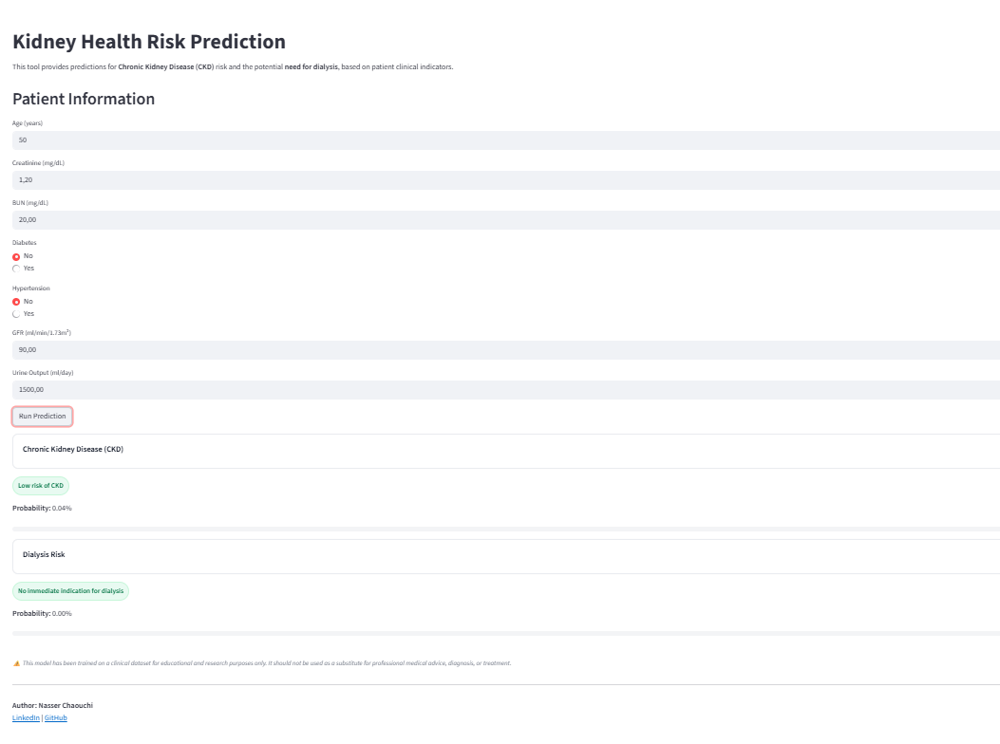

# Chronic Kidney Disease & Dialysis Prediction


This project aims to **predict Chronic Kidney Disease (CKD)** and **assess dialysis needs** using clinical and biochemical indicators. It features:

- A complete ML pipeline (EDA → preprocessing → modeling → evaluation)
- A **Streamlit app** for interactive risk prediction
- A clean, interpretable codebase and notebook

[**Try the app online:**](https://kidneydiseaserisk-ztfzun65jllcekaongmccj.streamlit.app/)




---

## Project Structure

- `dataset/` – kidney_disease_dataset.csv
- `kidney_disease_risk_classification.ipynb` – Notebook with full analysis & modeling
- `rf_ckd_model.pkl` – Trained Random Forest model for CKD
- `rf_dialysis_model.pkl` – Trained Random Forest model for dialysis need
- `app.py` – Streamlit app to run predictions
- `requirements.txt` – List of required Python packages

---

## How to Run the Project Locally

### 1. Clone the Repository

```bash
git clone https://github.com/nasser-chaouchi/ckd_dialysis_prediction.git
cd ckd-dialysis-prediction
```

### 2. Create and activate a virtual environment

```bash
python -m venv venv
source venv/bin/activate  # On Windows: .\venv\Scripts\activate
```

### 3. Install dependencies

```bash
pip install -r requirements.txt
```

### 4. Launch the Streamlit app

```bash
streamlit run app.py
```


## ML Models Used

Two binary classification tasks were addressed:

1. **CKD Detection** – Whether a patient has Chronic Kidney Disease  
2. **Dialysis Need Prediction** – Whether a CKD patient needs dialysis

We evaluated the following models:

- Logistic Regression  
- Random Forest 
- Gradient Boosting  
- K-Nearest Neighbors  
- XGBoost  

After evaluation, **Random Forest** was selected for both tasks due to:

- High F1-macro scores  
- Balanced performance across classes  
- Robustness to outliers and feature scaling  
- Interpretability through feature importance  

---

## Performance Summary

### 🔹 CKD Classification

| Model                | F1-score (macro) |
|----------------------|------------------|
| Gradient Boosting    | 1.0000           |
| Random Forest        | 0.9988           |
| XGBoost              | 0.9975           |
| KNN                  | 0.8740           |
| Logistic Regression  | 0.8262           |

**Final Test Accuracy**: `100%`  
**Macro F1-score**: `1.00`

---

### Dialysis Need Prediction

| Model                | F1-score (macro) |
|----------------------|------------------|
| Gradient Boosting    | 1.0000           |
| Random Forest        | 0.9747           |
| XGBoost              | 0.9538           |
| Logistic Regression  | 0.8375           |
| KNN                  | 0.4966           |

**Final Test Accuracy**: `99.9%`  
**Macro F1-score**: `0.97`

---


## Business Impact

Chronic Kidney Disease is a major global health challenge, with millions of patients requiring costly long-term care.  
This project demonstrates how machine learning models can support:

- **Early detection** of CKD for timely intervention  
- **Prediction of dialysis needs** to anticipate hospital resources  
- **Decision support** for healthcare professionals  

Such predictive models highlight the potential of **AI-assisted healthcare**, reducing risks and optimizing treatment strategies.

---

## Disclaimer

**Important Notice**  
This project and the deployed application are intended **solely for educational and research purposes**.  
They must not be used as a substitute for professional medical advice, diagnosis, or treatment.  
Always consult qualified healthcare providers for medical concerns.


## Built With

- Python  
- scikit-learn  
- pandas, numpy, seaborn, matplotlib  
- xgboost  
- Streamlit  
- joblib  

---

## Author

**Nasser Chaouchi**  
Machine Learning & Data Science  
[LinkedIn](https://www.linkedin.com/in/nasser-chaouchi/)

---

## License

This project is licensed under the [MIT License](LICENSE).

